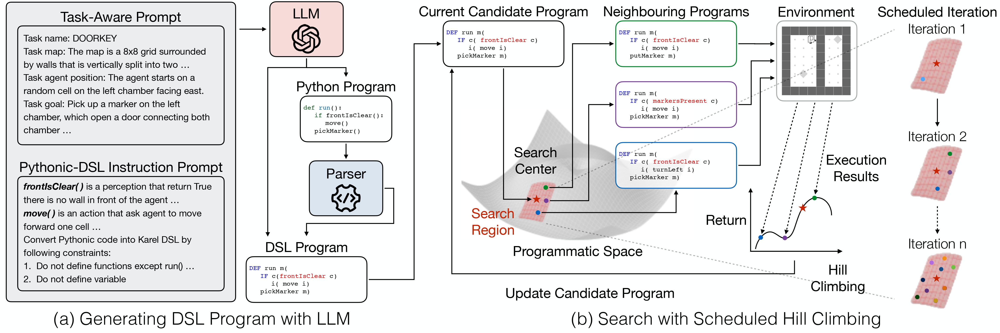

# [ICLR'25] Synthesizing Programmatic Reinforcement Learning Policies with Large Language Model Guided Search

This repository officially implements [**Synthesizing Programmatic Reinforcement Learning Policies with Large Language Model Guided Search**](https://arxiv.org/abs/2405.16450).

LLM-GS combines the large language model and search algorithms for solving Programmatic Reinforcement Learning (PRL) problems. LLM-GS has a good sample efficiency in Karel environments. Also, LLM-GS shows good extensibility to novel tasks and adaptability to the novel environments of [MInigrid](https://github.com/Farama-Foundation/Minigrid).




## Getting Started

### Clone

After you download the repo, please initialize the leaps submodule.
```bash
git submodule update --init --recursive
```

### Dependencies

We recommend using `conda` to install the dependencies:

```bash
conda env create --name llm_gs_env --file environment.yml
pip install -r requirements.txt
```

If `conda` is not available, it is also possible to install dependencies using `pip` on **Python 3.8**:

```bash
pip install -r requirements.txt
```

After installing the environment, please export your **OpenAI API key** to execute our main method:
```bash
export OPENAI_KEY="YOUR_API_KEY"
```

### Execution
To execute our main method and baselines. You can change **method** and **task** inside the scripts. **(LLM-GS is our main method.)**

```bash
bash scripts/run_main_results.sh
```

Or you can run specific algorithm and tasks
```bash
# All scripts are in scripts/{baseline}/run_{task}.sh
bash scripts/LLM-GS/run_DoorKey.sh
```

You can run revision method of the task DoorKey
```bash
# The revision scripts are in scripts/evision/run_{revision_method}.sh
bash scripts/LLM-Revision/run_regeneration.sh
```

Please note that the result of LLM-GS might not be the same as the one we reported in our paper due to the randomness of the LLMs.

The experiment results will be in the `output` directory.

## Adapting LLM-GS to Your Environment

To use LLM-GS for your custom PRL task:

1. **Define your DSL**
   Create a new DSL in `prog_policies/your_dsl/` and specify production rules.

2. **Register your environment**
   Add it to `prog_policies/utils/__init__.py`.

3. **Implement your PRL environment**
   - Write your environment in `prog_policies/your_environment/`
   - Option A: Subclass `BaseEnvironment` in `prog_policies/base/environment.py`  
   - Option B: Use `gymnasium.core.Wrapper`

4. **Write your prompt template**
   Follow `llm/prompt_template.py` structure to write your system prompt and user prompt.

5. **Set up search space (if needed)**
   Create a custom search space in `prog_policies/search_space`. You can specify your mutation method here for local search. If the production rules are more complicated than Karel's, writing your own search space is necessary.

6. **Parse LLM output**
   Use `convert()` and `get_program_str_from_llm_response_dsl()` in `llm/utils.py` to post-process Python and DSL programs.


## Acknowledge and licence

1. The baseline implementations in `prog_policies` are from [Reclaiming the Source of Programmatic Policies: Programmatic versus Latent Spaces](https://github.com/lelis-research/prog_policies). The baselines (CEM, CEBS, HC) code under `prog_policies` should follow the GPL-3.0 license.
2. The [HPRL](https://arxiv.org/abs/2301.12950) baseline implementation is not in this repository. We run our experiment in [this repository](https://github.com/a015kh/hprl)

## Citation

```bibtex
@inproceedings{liu2025synthesizing,
    title     = {Synthesizing Programmatic Reinforcement Learning Policies with Large Language Model Guided Search},
    author    = {Max Liu and Chan-Hung Yu and Wei-Hsu Lee and Cheng-Wei Hung and Yen-Chun     Chen and Shao-Hua Sun},
    booktitle = {The Thirteenth International Conference on Learning Representations},
    year      = {2025},
}
```